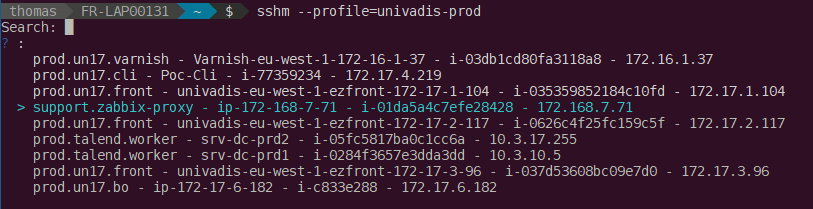
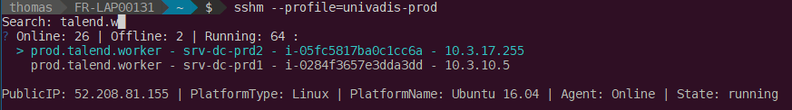
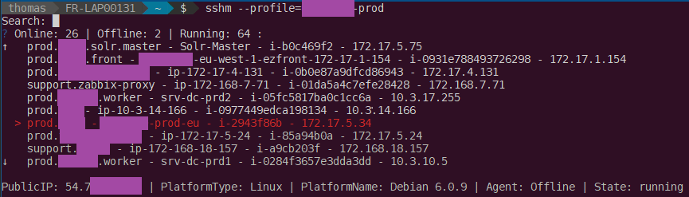

# SSHM

## Description

Easy connect on EC2 instances thanks to AWS System Manager.

## Prerequisites

Install `session-manager-plugin` : https://docs.aws.amazon.com/systems-manager/latest/userguide/session-manager-working-with-install-plugin.html

## Usage

```bash
Usage of sshm:
    -profile string
        Profile from ~/.aws/config (default "default")
    -region string
        Region (default "eu-west-1")
```
You can select your instance by &larr;, &uarr;, &rarr; &darr; and filter by typing. **Enter** to validate.

## Output Example





## Build

```bash
go build
```
This repository uses `go mod`, so don't `git clone` inside your `$GOPATH`.

## Author

Thomas Labarussias (thomas.labarussias@fr.clara.net)